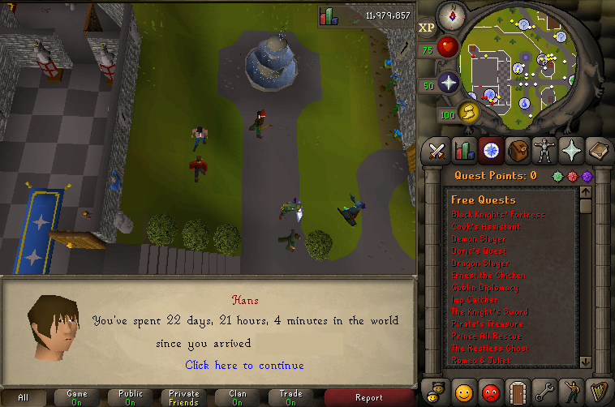

# QuestCapeTools
The spreadsheets and tools I created to assist in speedrunning all quests in Old School Runescape.

At the beginning of 2017, I completed a speedrun from 0 to 251 (max) QP in 89 hours and 25 minutes. These are some of the quick tools I created to achieve the goal. 

See the [Reddit announcement here](https://www.reddit.com/r/2007scape/comments/5xb3k8/ive_finished_a_speedrun_of_all_quests_in_osrs/).

## What you're probably interested in...
[quests.csv](quests.csv) contains the questing order, difficulty/length ratings, 2007scape Wiki Quest Guide links, estimated completition time, and start locations of all quests in Old School Runescape as of 3/11/2017. How I made it...

### Giant Shopping List
At the start of the speedrun, I went to the Grand Exchange before every quest to pick up requirements, but this was tedious and ate up a lot of time. As a quick fix, I wrote [a python script](print_items.py) that aggregates all of the item lists (as well as it can) from scraping all of the 2007scape Wiki quest guides. Although I don't have a copy of all of the quest guides, you can run `wget` on [guides.txt](guides.txt) into a `guides/` directory to use the script yourself. There are a couple quests with complicated item lists (Recipe for Disaster) that will output "Failed :(" you'll need to add-in by hand.

### Topologically Sorted Quests
Quests in Runescape often depend on the prior completition of other quests, which also depend on other quests. To avoid missing dependencies, I used [topological sorting](https://en.wikipedia.org/wiki/Topological_sorting) to partition all quests into 6 different sets to be completed in order. Within these sets, quest order does not matter.

I aliased [quest names and their requirements into integers](dag.csv) and then sorted them [in a python script](toposort.py).

